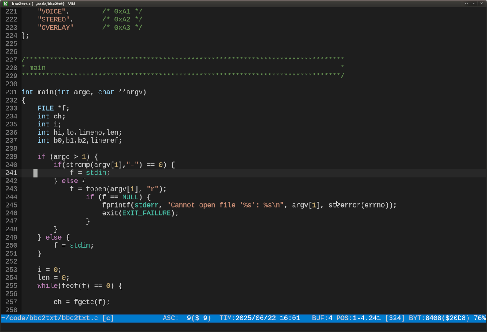

# vim-colorschemes

My color schemes for the Vim editor.

Two minimalist yet expressive Vim colorschemes tailored for C programming.
Whether you prefer high contrast or darker tones, `rs4l` and `rs4d` are
designed to keep your focus on the code.

## Colorschemes

### rs4d

- Dark, low-contrast aesthetic
- Loosely based on Visual Studio Code's default dark theme
- Optimized for late-night coding
- Muted tones for reduced eye strain
- Consistent with terminal-friendly themes

### rs4l

- Bright, high-contrast palette
- Based on my very first attempt to create a Vim color scheme around 2003
- Ideal for well-lit environments
- Vibrant keywords, clear function and type distinctions

## Installation

Just download or clone the repository and move the files `rs4l.vim` and `rs4d.vim` to your Vim `colors` directory (likely `~/.vim/colors`).

